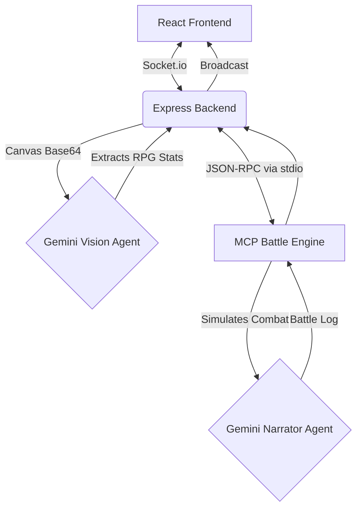

# DoodleDoom ⚔️ — AI Drawing Arena


A real-time, multiplayer drawing auto-battler powered by **Google Gemini** and the **Model Context Protocol (MCP)**. Draw your warrior, let AI evaluate it, and watch them fight!

Built for the **Kaggle AI Agents: Intensive Vibe Coding Capstone (Freestyle Track)**.

## 📖 The Problem & Solution
Generative AI often replaces human creativity with hyper-polished outputs. **DoodleDoom** flips the script: it uses GenAI to *validate* and *gamify* our chaotic, hand-drawn art. 

Players join a lobby, draw a prompt on a shared canvas in 60 seconds, and a **Vision Agent** evaluates the pixels to generate balanced RPG stats. Those stats are fed into a completely decoupled **MCP Battle Engine**, which simulates a dynamic, turn-based fight to the death with live commentary.

## 🏗️ Architecture Flow



## 🌟 Key Technical Features

### 1. Multi-Agent System
- **Vision Agent:** Analyzes raw pixel data to assign balanced stats. Spiky shapes yield high attack; bulky shapes yield high defense/HP.
- **Narrator Agent:** A secondary AI running inside the MCP server that acts as a color commentator, generating turn-by-turn action and dynamic character taunts.

### 2. Custom MCP Server
The Battle Engine is a **standalone Model Context Protocol (MCP) server**. The Express backend acts as an MCP Client, routing the extracted RPG stats over `stdio` transport. This completely decouples the deterministic battle logic from the web socket routing.

### 3. Security & Stability Features
- **Rate Limiting:** Express middleware prevents abuse of the Gemini API endpoints.
- **Session Recovery:** A `SessionID` architecture allows players to drop connection and instantly rejoin without losing their lobby state or score.
- **Glitch Fallback:** If the Gemini Free-Tier API rate limits are hit, the system automatically catches the error and forces a cinematic "Glitch Battle" rather than crashing.

### 4. Deployability
The entire stack (React frontend, Express backend, and MCP child process) is unified via a **Multi-Stage Dockerfile**. It can be deployed to **Google Cloud Run** in a single command, offering autoscaling and a public HTTPS endpoint.

## 🚀 Local Setup Instructions

### Prerequisites
- Node.js (v20+)
- Google Gemini API Key

### Option 1: Standard Node Setup

1. **Clone the repository:**
   ```bash
   git clone <repo-url>
   cd capstone
   ```
2. **Set your API Key:**
   ```bash
   echo "GEMINI_API_KEY=your_key_here" > backend/.env
   ```
3. **Install Dependencies:**
   ```bash
   cd backend && npm install
   cd ../mcp-battle-engine && npm install
   cd ../frontend && npm install
   ```
4. **Start the Servers (in two terminals):**
   ```bash
   # Terminal 1: Starts Backend and MCP Engine
   cd backend && npm start
   
   # Terminal 2: Starts Frontend
   cd frontend && npm run dev
   ```
5. Open `http://localhost:5173` in your browser!

### Option 2: Docker / Google Cloud Run Deployment

1. **Build and run locally via Docker:**
   ```bash
   docker build -t doodledoom .
   docker run -p 8080:8080 -e GEMINI_API_KEY="your_key" doodledoom
   ```
2. **Deploy directly to Google Cloud Run:**
   ```bash
   gcloud run deploy doodledoom \
     --source . \
     --platform managed \
     --region us-central1 \
     --allow-unauthenticated \
     --set-env-vars GEMINI_API_KEY="your_key"
   ```

## 📝 Kaggle Submission Notes
- **Track:** Freestyle
- **API Keys:** No API keys are stored in this repository. Use your own key via the `.env` file or Cloud Run environment variables.
